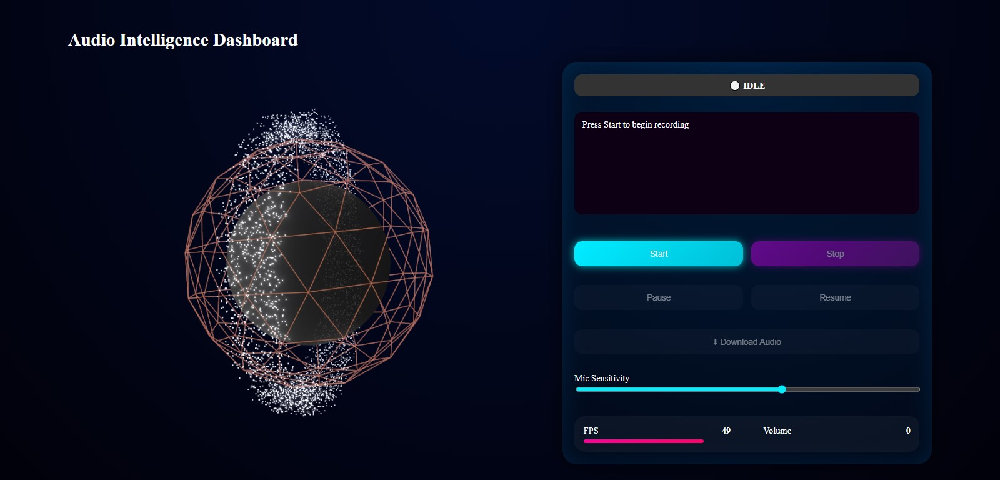

# 🎧 Real-Time Audio Intelligence Platform

A full-stack **real-time audio streaming and transcription platform** built using **React (Vite)** on the frontend and **Spring Boot WebFlux + WebSockets** on the backend. The system captures live microphone audio, streams it to the backend over WebSockets, and displays real-time transcription on an interactive dashboard UI.

---

## 🚀 Live Deployment

- **Frontend (Vercel):** https://real-time-audi-intelligence-platfor.vercel.app/
- **Backend (Render):** [https://real-time-audi-intelligence-platform-2.onrender.com](https://real-time-audi-intelligence-platform-2.onrender.com)
- **GitHub Repository:** [https://github.com/Ambarubale6061/Real-Time_Audi_Intelligence_Platform](https://github.com/Ambarubale6061/Real-Time_Audi_Intelligence_Platform)

---

## 🖥️ Dashboard UI Screenshot

> Below is a screenshot of the main dashboard interface showcasing the real-time audio visualizer, control panel, and live transcription area.



_(Add one screenshot named `dashboard-ui.jpg` inside a `public/` folder)_

---

## 🧠 Architecture Overview

```
┌──────────────┐        WebSocket (wss)
│   Frontend   │  ─────────────────────▶  │   Backend   │
│ React + Vite │                           │ Spring Boot │
│              │  ◀─────────────────────  │  WebFlux WS │
└──────────────┘        Live Transcripts
```

### Frontend

- Built with **React + Vite**
- Captures microphone audio using Web Audio API
- Streams audio chunks over secure WebSocket (`wss://`)
- Displays real-time transcription and audio visualization

### Backend

- Built with **Spring Boot WebFlux**
- WebSocket-based real-time streaming (`/ws` endpoint)
- Non-blocking, reactive architecture
- Modular service-based design (easy to plug in AI APIs)

---

## ✨ Key Features

- 🎙️ Live microphone audio capture
- 🔁 Real-time audio streaming via WebSockets
- 🧠 Streaming transcription pipeline (extensible)
- 📊 Interactive dashboard UI
- ⚡ Reactive & non-blocking backend
- ☁️ Cloud deployment (Render + Vercel)
- 🐳 Dockerized backend for production readiness

---

## 📁 Project Structure

```
Real-Time_Audi_Intelligence_Platform/
│
├── frontend/
│   ├── src/
│   ├── public/
│   ├── package.json
│   └── vite.config.js
│
├── backend/
│   ├── src/main/java/com/ai/audio/
│   │   ├── config/
│   │   ├── controller/
│   │   ├── service/
│   │   ├── model/
│   │   ├── util/
│   │   └── AudioApplication.java
│   ├── src/main/resources/application.yml
│   ├── Dockerfile
│   └── pom.xml
│
└── README.md
```

---

## 🐳 Backend Deployment (Render)

- Backend is containerized using **Docker**
- Java 17 runtime
- Spring Boot executable JAR
- WebSocket-compatible deployment

Render automatically builds and runs the container using the provided `Dockerfile`.

---

## 🌐 Frontend Deployment (Vercel)

- Frontend deployed using **Vercel**
- Environment variables used for backend URL

Example:

```
VITE_API_URL=https://real-time-audi-intelligence-platform-2.onrender.com
```

---

## 🔌 WebSocket Endpoint

```
wss://real-time-audi-intelligence-platform-2.onrender.com/ws
```

Used by the frontend to:

- Send audio stream data
- Receive live transcription messages

---

## 🧪 Local Development

### Backend

```bash
cd backend
mvn spring-boot:run
```

### Frontend

```bash
cd frontend
npm install
npm run dev
```

---

## 📌 Notes

- The transcription service is designed to be **extensible** and can be integrated with real AI speech-to-text APIs (Gemini, OpenAI, etc.)
- For assignment/demo purposes, the focus is on **real-time architecture, streaming, and deployment**

---

## 👤 Author

**Ambar Ubale**
Full Stack Developer
GitHub: [https://github.com/Ambarubale6061](https://github.com/Ambarubale6061)
